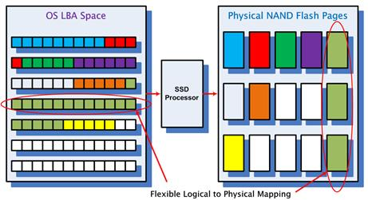
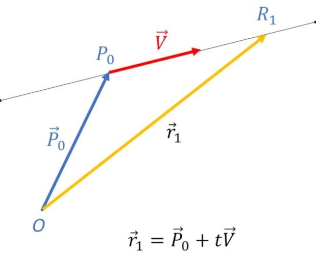
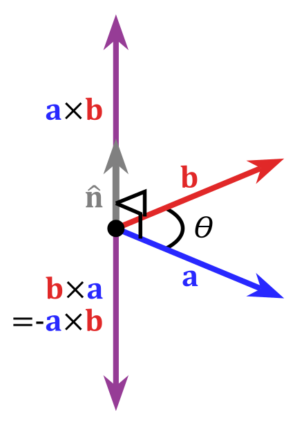
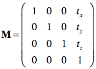
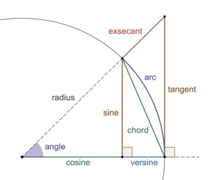
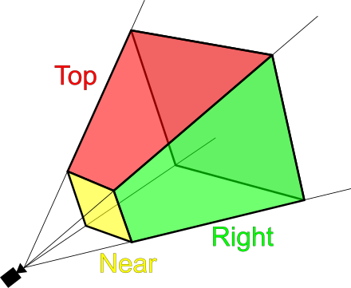

This is intended to be the "introduction to mathematics", where we'll go over the following syllabus:

- **Algebraic Math**: *Real Number; Arithmetic; Vector Algebra; Coordinate Systems; Matrices; Normalization; Systems of Equations; Set Theory; Expression; Logarithm; Linear; Polynomial; Quadratic; Piecewise; Parametric; Exponential; Rational; Logarithmic; Inverse; Periodic; and Transfer functions*

- [**Matrix Multiplication**](matrix.md): *I'm experimenting with the best way to illustrate matrix multiplication*

- [**Midian Larune**](midian.md) *Rational Trigonometry, States, Spreads, Quadrances, Reciprocal Properties, Isometric Transformations*

- **Geometry**: *Scalar, Vector, Plane & Solid Geometry; Transformation; Geometric Primitives; Affine & Projection Matrices*

- **Calculus**: *Vector Calculus; Differential Equations; Derivatives; Integrals; Limits; Tangent/Area Math Problem*

- **Logic**: *Reasoning & Proof*

- **Waves**: *Wave Propogation; Anything Wave-related*

- **Fractal Geometry**: *Complex Number, Complex Dynamics*

- [**Symbols by Subject**](glossary.md) *This page i have created is a glossary of some of those mathematical symbols we'll be using, in the basic multilingual plane (plane 0) utf-8 encoding


**About this document**: Please note, that the `^` symbol can be used to represent *"to the power of"*, or `XOR` in programming, and in the case of the ladder situation, i'll use specifically `⊕` and that way you always know what i mean.


**Scalars** (*s*) are quantities that are fully described by a size (numerical value), without any associated direction. Scalars can be represented by whole numbers or real numbers, providing a comprehensive selection of possible values to describe magnitude without regard to direction (a scalable value). Where the term "number" represents mathematical objects in a generic sense, scalars on the other hand represent a subset of numbers that are specifically used to describe quantities. In the same way, multiplication and division are operations that specifically work w/ groups.

**Fractions** are mathematical expressions representing parts of a whole or ratios between two quantities. They consist of a numerator and a denominator separated by a horizontal line, commonly known as the fraction bar. The numerator signifies the number of parts being considered, while the denominator represents the total number of equal parts into which the whole is divided. Conceptually, fractions also represent a division operation, where the numerator is divided by the denominator. This implies that a fraction can be interpreted as the result of dividing a whole into equal parts, with the numerator indicating how many of those parts are being considered.

Moreover, fractions can be converted into decimal form by performing the division operation. Dividing the numerator by the denominator yields a decimal representation. Each decimal place on the left is `10^n`, or `10^-n` on the right, therefore multiplying by `10^n` displaces the decimal point to the right. For example, in scientific notation: `3.5 × 10^4` represents `35,000`, where you'd move the decimal point to the right effectively adding decimal places to the left of it.

To verify a conversion from fractional to decimal, take the example `3/4`, which you know has to be less than zero. Consider each decimal place value after "0". In `0.00`, the ".0" is in the tenths place, and the ".00" is in the hundredths place. So, if we chose (0.75), it represents (7 tenths) and (5 hundredths). In fraction form, this is `7/10 + 5/100` (now you have to multiply both parts of a fraction by the same number in order to compare it to the opposing operand, (`7*10/10*10`)... so we're left w/ `70/100 + 5/100 = 75/100`. To reduce or simplify the fraction `75/100`, you divide both parts by the greatest common divisor which is `25`, and you get `3/4`, meaning your answer was right, `75%`

**Variables** are often used to represent unknown quantities or parameters in mathematical expressions or equations. For example, in the equation `ax+b=0`, `x` is a variable representing an unknown value, while `a` and `b` may be considered the constants (depending on the situation). Constants have a specific, fixed value that does not vary within the scope of a problem. `π` is one such example. `ax+b` is an expression(or polynomial), and `ax+b=0` is the equation (more about equations and expressions as polynomials later)

In an algebraic expression, coefficients are the numbers that multiply the variables or terms. For e.g. in (`3x`), the number 3 is a coefficient.

Subscripts: are small characters or numerals positioned slightly below the normal line of text. They are typically used to denote indices, labels, parameters, or specific elements within a mathematical expression.

Prime symbol (the apostrophe after a variable) can mean its a related/modified version, as well as within a certain order of derivatives and so forth.

Superscripts: are small characters or numerals positioned slightly above the normal line of text or script. They are commonly used to denote exponents, powers, or other elevated quantities in mathematical expressions.

**Operators** are symbols or functions that represent mathematical operations or transformations on one or more operands to produce a result. Operators are fundamental to mathematical expressions and equations, and allow us to perform various calculations and manipulate quantities. If you havent yet memorized all your "times tables" for example, no worries. Alot of people have never learned them, and continue to later in life. Lets just briefly describe each:

**Order of operations** in math is typically remembered using the acronym PEMDAS, which stands for Parentheses, Exponents, Multiplication and Division (from left to right), and Addition and Subtraction (from left to right). This is the sequence in which operations should be performed in expressions.

**absolute value** of a non-positive number (negative or zero) is the positive version of that number.

**reciprocal** of a number is simply its multiplicative inverse. (i.e. reciprocal of `3` is `1/3`) In other words, for a nonzero number `x`, the reciprocal of `x` is
`(1/x)` or equivalently, `x^(-1)`. And in that sense, any number `x` is the same as writing `x/1`

Addition is the process of adding two numbers together, and the result is called the sum. Subtraction is the process of "taking away" one number from another, and the result is called the difference. Multiplication is the process of adding a number "that many times" to itself and is called the product *(in the same way an exponent represents the multiplication of a number "that many times" to itself)*
Why is any number `n` times 1 equal to itself?... Well lets look at what happens in addition. For addition, any number plus 1 is 1 more than that number, so you know that you cannot have, (1*n) of any number equal to one more, simply because that is effectively the same as adding 1, you also know multiplication works w/ groups, therefore `1*n` or `n` can be rewritten as `1n`. It is the same as saying "one of this kind of group".

Multiplication is interesting because it creates repeated patterns of numbers and sequences within the equations.

Multiplication of fractions can be illustrated w/ `(a/b) * (c/d) = (a*c) / (b*d)`, where you swap the denominator w/ the numerator like that.

Division is the opposite to multiplication, and it represents "taking away" a number that many times, and the results called a quotient. Division is the same as multiplying by the reciprocal, and a good example to illustrate this is: `1/x+a / a`... then we can rewrite it as `1/a(1/x+a - 1/x)`... Then inside the parentheses, we enclose those terms... `1/a((1/x + a) - (1/x))`, and simplified it becomes... `1/a * a`... or the answer `(1)`

**Square**, what is a square? In simple terms its one side length times another side (area), however squares are a bit weirder than i thought. They have sides that all depend on one another, 4 times or (P = Side(4x)). When we think about shapes we consider the dependency of those sides, and so if one side changes then an equal and opposite change will happen to the others. If one side changes and we dont change the others then we are changing that shape entirely, and in that sense squares are weirder than i thought.

This also shows you that things are not entirely straightforward when it comes to compatibility between vertices. For one thing, you cannot simply add two meshes or shapes of variables together that are different, unless you want to have very unpredictable and incorrect equations. It is odd to even think of what "square + rectangle" would even mean in the first place, although if you know what the implications are behind shapes and which profiles of said shape depend on the "Side(N)" characteristics, then you can gather (or assume) what that question is trying to illustrate.

Obviously its nice to have all the questions initially answered from the onset - although the quest of life is not always like that, and its not uncommon for us to find ourselves in situations (in math or programming) where only one answer can be realized during the onset, wherein you construct an interpretation that satisfies your own criterion. Lets call this the self-sufficient method, which also ties in with another idea im a fan of, "solving problems in situations where there are no initial answers", or "a blind test". Although hopefully while reading this you dont feel as though im imposing a blind test onto you.

**Exponent**
When you see `^`, it refers to the repeated multiplication of some number by itself (raising a number to a certain exponent) For example, in the expression `a^n`, `a` is the base and `n` is the exponent, the result is the nth power of `a`.


When you have the expression `x/y` it can be rewritten as `x * y^(-1)`, which is is equivalent to `x * y^(1/-1)`... If you consider the denominator as `x^(1/n)`, then `n = -1`.


A base power `2` of a number `x` is the same as sqrt, i.e. `sqrt{x}` = `x^(1/2)`. *Order of operations matters or else you'd have `(1^1)/2`, hence the preferred `sqrt`, however its easier to think in terms of some power of a fraction, and other such conversions that we'll go over.*

The opposite of `n log(x)` is to raise the base `x` to the power of `1/n`, which is written as `x^1/n` This operation is often referred to as taking the nth root of `x`... Logarithms can be expressed as `log b(n) = x`, where `b` is the base, `x` is the exponent to which the base must be raised to produce `n` (i.e. the number being operated on)

So you can have for e.g. `log2(8)=x`, which means you're finding the exponent to which `2` must be raised to produce `8`. In this case, `x` would equal `3`, i.e. `2^3 = 8`

Modular aerithmetic, which is a mathematical concept where you take the remainder after a division by a certain number (the modulus) can be written as `x mod y`, which you can consider the opposite of division, can be illustrated when `x` is greater than or less than `y` as e.g.

`10 mod(3)`, `3` goes into `10` (3x), `3 * 3 = 9`, and `10 - 9` = The answer: `1`

`4  mod(7)`, `4` goes into `7`  (0x), `0 * 7 = 0`, and `4 - 0` = The answer: `4`

Any number modulo `0` is undefined. Division by `0` is undefined in mathematics as a rule.

Any number modulo `1` is always `0`. This is because dividing any number by `1` always results in that number with no remainder.

Any even number modulo `2` is `0`. This is because an even number can be divided evenly by `2`.

And any odd number modulo `2` is `1` which is because, dividing an odd number by `2` you get a quotient of `0` with a remainder of `1`.

So odd numbers are integers that are not divisible by 2, while even numbers are integers that are divisible by 2. Therefore, because they span the entirety of all real numbers (forming the basis for divisibility and parity concepts in arithmetic) one could exploit this to understand deeper relationships as well as find patterns, and algorithms.

**Prime numbers** are another such example. Prime numbers are integers greater than 1 that have exactly two distinct positive divisors: 1 and themselves. They are the building blocks of the integers, as every integer greater than 1 can be uniquely expressed as a product of prime numbers, a concept known as the Fundamental Theorem of Arithmetic. Prime numbers are of central importance in number theory and other fields.

And... Not that i want to muk up what is already becoming a challenging assignment for someone new, however its actually possible to illustrate the utility of modulus in conjunction with memory addresses, and why we might invoke them in such situations. Consider that you can have a stack of addresses that may wrap around at some given point in the program. If you had `0x1f00` minus `0x2000` that may seem like it goes into a negative area, however you have to think about it a little differently, and in terms of the maximum address and subtracting from it; or the minimum address and adding to it... Does that make sense?

And if it doesnt thats okay, because it doesnt to me either, as we have no way of knowing for sure what it may mean to minus something, if its the former or the ladder. So to use operations like addition and subtraction in the context of memory addresses is a bit of a blind test, in my opinion. I personally dont know how its meant to be interpreted, so there must be a better way to think about it.

In memory addressing, the size of the address space may define our modulus (pause to make sure your head didnt pop off, lol)  For a 16-bit system with addresses from `0x0000` to `0xFFFF`, the modulus would be `0x10000` (65536), which is a boundary condition for wrapping around in the circular memory space. And the track would have 65536 (2^16) positions, labeled from `0x0000` to `0xFFFF`.

Memory addresses are typically represented in hexadecimal (base 16) for conciseness. The modular arithmetic for wrap-around calculations still applies regardless of the base used. To find the offset between two addresses (`A` and `B`), you can use the modulo operation: `offset = (B - A) mod (address_space_size)`, to ensure the offset stays within the valid range `(0  to "address_space_size" -  1)`,   even if the subtraction results in a negative value due to wrap-around.

`B-A` tells you how many positions you need to move clockwise from `A` to reach `B`. It could be a positive value if `B` is "after" `A`, or a negative value if `B` is "before" `A` on the circle (due to wrap-around). The offset just says the distance between `A` and `B` within the circular memory space. It doesn't matter if `B` is a larger address that "wraps around" `A`. The modulo operation handles that. 


**Mathematical Equivalents**

When you left shift a binary number by `n` bits, you effectively multiply the number by `2^n`. Take this for example, `5 << 2` is equivalent to `5 * 2^2`. Each left shift moves all the bits in the binary representation of the number to the left by `n` positions, effectively appending `n` zeros to the right. For a binary representation of `5` (which is 101101) it is left shifted two positions, resulting in `1010010100`, which is `20` in decimal. And the same is the case for right shifting, which is equivalent to dividing a number by `2^n`. The choice to replace a regular operation with a bitwise one often leads to faster code, so you can exploit this fact and use it in all kinds of ways for optimizing any operation.

Suppose we want to represent a number with (26) bits for the integer part, (6) bits for the fractional part (26.6 fixed-point format). Each bit in the fractional part represents a power of 2. In this case, the largest power of 2 represented in a 6-bit wide fractional part is 2^6 (or 64). The "6" in 2^6 comes directly from the number of bits dedicated to representing the fractional part. This scaling factor of 64 means, to convert from fixed-point to integer we need to divide by 64, which is achieved by shifting the value right by 6 bits (value >> 6).

Note, the fixed-point format aligns with how the library or system represents metrics. That is, the need for conversion arises because internal metrics might need more precision (hence `value / 64`), i.e. a format that it deemed useful for rendering purposes.

Because this is also related to arithmetic, i should also talk about truncation in the context of integer types. That is, when performing integer division the result is truncated as opposed to rounded. This means that the fractional part of the division is simply discarded, like when calculating e.g. pixel widths, memory offsets, or array indices. Thus, integer division and its behavior in C is an important factor to keep in mind. Alignment in memory or data structures often relies on integer division to determine how to align data on specific boundaries (e.g., aligning data on 4-byte or 8-byte boundaries). If you're aligning to a certain boundary, truncation ensures that any of the *excess* that goes beyond the required alignment, is disregarded. To learn about the rules of "rounding" in the context of floating-point arithmetic you should look for C Standard Library References online which often mention it.

Arithmetic Logic Unit (ALU) of the CPU, is responsible for performing basic arithmetic operations (addition, subtraction, multiplication, division) and logical operations (AND, OR, XOR, etc.)

We can demonstrate what happens in computation when you add something, using two digits in the result, representing the binary representation of the sum. As we said, each digit in the binary result corresponds to a power of `2^n`: the rightmost digit is 2^0 (1s place), the next digit is 2^1 (2s place), and so on.

`0 + 0 = 00`, the sum is 0, which in binary is simply 0 (0 x 2^0).

`0 + 1 = 01`, the sum is 1, which in binary is 1 (1 x 2^0).

`1 + 0 = 01`, the sum is 1, again represented as 1 (1 x 2^0).

`1 + 1 = 10`, here, the sum is 2. In binary, this is 2 (1 x 2^1) + 0 (0 x 2^0).

Then we can illustrate this w/ the binary addition algorithm, using bitwise logical operations like XOR (^) and AND (&)

` bit 0 of sum: S = a^b  `, and   ` bit 1 of sum: C = a&b `

**Generate** and **propagate** functions are key concepts that help determine the carry bits in a binary addition operation more efficiently than a ripple-carry adder. Various branches of mathematics, laws and equations are used to understand electronic circuits and systems, but thats probably way beyond the realm of this cordial colloquy. Also, note that modern processors often utilize some form of carry-lookahead logic (and other more advanced adder circuits) for faster addition, especially in the Arithmetic Logic Unit (ALU) responsible for calculations. For fun i made an illustration of a [**half adder**](NOR.md) circuit in ascii art (i make these ascii circuits all the time)

Regarding numeral systems, there’s a systematic way to convert binary to its decimal (or hexadecimal) equivalent. To convert hexadecimal digits, you can find tables online that illustrate the base, or radix *16* nature of each digit. The digits 0-9 represent the values 0-9, and the remaining 6 digits you count from afterward are *A,B,C,D,E,F,10*. And you'd presumably start from 11 as if beginning from "1" again.

Converting hexadecimal to binary is straightforward because each hexadecimal digit directly maps to a 4-bit binary equivalent, so 8-bits is equivalent to a hexadecimal byte (this'll make more sense when i go through octals). For translating binary itself, you can quickly identify the value of each "on" bit by remembering the sequence of powers of 2; So consider the value of each digit or place within a binary value as "..16.8.4.2.1":
- The rightmost bit is always 1 (i.e., 2^0).
- The next is 2 (i.e., 2^1).
- The next is 4 (i.e., 2^2).
- The next is 8 (i.e., 2^3).
- The next is 16 (i.e., 2^4).
- And so on... *Or simply put, you can multiply the answer of the last value by "2" to get the next place.*

Each digit in an octal (which is a base *8*) represents 3 binary digits, bits. And since a byte consists of 8 bits, it's possible to break down each byte into three groups of 3 bits (with the last group potentially being padded with zeros if necessary). For example, the binary number 11001010 can be grouped as 110 010 10, which corresponds to decimal 202 (or the octal number 312). For decimal, you just add each "on" bit together. Hopefully you can see where "3", "1" and "2" comes from. Octal is commonly used in file permissions, and stored in three groups of 3 bits (indicating *read*, *write* and *execute*), and each group is represented as a single octal digit. For example, rwxr-xr-x set w/ `chmod` corresponds to the octal value 0755...
```
    access  control  (permissions)
           11          10          9
          |           |           |
   8  7   6     5  4  3    2  1   0
   r  w  x/s   r  w  x/s   r  w  x/t
       U           G          O
```
In programming and mathematics, we often encounter sequences, such as sequences of bytes or numerical sequences, which follow specific patterns or rules. Just as each digit in a binary or hexadecimal number plays a crucial role in the overall value, each element in a sequence contributes to the overall structure or behavior of the system.


**Factorial** of a non-negative integer `n`, denoted by `n!` is the product of all positive integers less than or equal to `n`. For example  `5! = 5 * 4 * 3 * 2 * 1 = 120`. You might use it to consider purmutations of some string w/ identical items..

Keep in mind, that is different than "finding all possible arrangements of a group of items", as the ladder would treat identical items as they're in unique positions. But for permutations of identical items (e.g. MISSISSIPPI) we first count the total number of letters, which is 11. Then, we count the number of distinctly different letters, for each one reocurring (keeping consideration of their order). You then take the "total" number (factorial), and divide it by each distinctly different group (factorial)... `11!/4!*4!*2!` Ps. Order matters when you divide by the factorial of each sequence of identical items, it ensures that each distinct arrangement has been multiplied together, and counted only once and that the identical items remain within their respective groups or positions, but if you intend it to be an unordered string of characters, then it might not matter to you.


**Distributive property**

You can use distribution within arithmetic and algebraic expressions... The distributive property, usually portrayed as `a(b + c) = ab + ac`, means that both sides in the expression above are considered equal, and can thus be converted or represented by either the left hand or right hand side. However the distributive property is exclusive to the addition and subtraction of those variables.


**Principle of equality**, is when you perform operations on both sides of the equation though a technique that shares an equal but opposite relationship, in order to isolate variables or simplify an expression, consequently we're preserving the truth about that equation. Suppose we have the example: `x = (a - b)/y` ... We can rearrange this equation, first by multiplying both sides of the equation by `y`:

`x*y = a-b/y * y`

On the right-hand side, `y` in the numerator and `y` in the denominator cancel each other out:

`x * y = a − b`

So, using the principle of equality, the equation `x = a−b/y`, becomes `xy = a−b`


**Conversion**

Here's a real world example that illustrates the conversion i had to make from a select amount of memory (in GB) converted into whats called "sectors" (Mind you the image doesnt directly pertain to this problem, i just thought id try adding some visual stimuli related to solid state drives)... Before you do that, you should always make a note of whats called your **Knowns** versus your **Unknown** facts (and this is true for all formula-/pre-equations):

**Knowns**
`1 GB = 1024 MB` `1 MB = 1024 KB` `1 KB = 1024 bytes` `1 sector = 512 bytes`

Unkowns would be those facts that we want to extrapolate out of some formula..

`30 * 1024 * 1024 * 1024 / 512 = 62,914,560 sectors` is the answer, unless we want to elaborate on the conversion factor that occurs at each step along the way; First converting from GB to MB...

`30 GB * 1024/1 MB` Next, we convert by MB to KB..

`30GB * 1024MB/1GB * 1024KB/1MB` Then, we convert by KB to bytes..

`30GB * 1024MB/1GB * 1024KB/1MB * 1024 bytes/1KB` Finally, we convert from bytes to sectors..

`30GB * 1024MB/1GB * 1024KB/1MB * 1024 bytes/1KB * 1 sector/512 bytes` and sometimes its more clear to break an equation into parts.

*Note, that multiplying by `1/512` is the same as dividing the corresponding product by 512*


**Cross multiplication**
Is a useful method for solving equations that involve fractions, particularly when dealing w/ proportions (dimensions). It allows you to solve for one variable in terms of the other variables or fractionary components, multiplying both sides of a proportion by the least common denominator. 
`2 cups of sugar/24 cookies = X cups of sugar/36 cookies`

Then we apply cross multiplication to solve for X:
`2 * 36 = X * 24`

Now we can solve for X by dividing both sides of the equation by 24:
`X = (2*36)/24`

`X = 72/24`  and  `72/24 = 3 cups of sugar`

We will continue decribing methods for solving equations and other sorts of relationships as we go.


**True vector vs. Pseudo-vector**:
This is something physics related, specifically to vector quantities and their behavior under certain transformations, but if we are gonna try to learn things about 'correct geometry', then it should include the most fundamental ideas that exist. 

True vectors also known as polar vectors, are quantities that have both magnitude and direction and behave consistently under coordinate transformations. Examples of true vectors include displacement, velocity, acceleration, force, and electric field. These vectors follow the rules of vector addition and transformation, and their direction does not change under rotations, translations, or reflections.

Pseudovectors, also known as axial vectors or improper vectors, are quantities that also have magnitude and direction but exhibit a different behavior under certain transformations, such as reflections. While they behave like true vectors under rotations and translations, their direction reverses under reflections. Examples of pseudovectors include angular momentum, torque, magnetic field (in certain contexts), and the cross product of two vectors. The direction of a pseudovector is defined by the right-hand rule, and it flips when the coordinate system is reflected.


**Orientation**
refers to the relative position or direction of objects, lines, or surfaces in relation to each other or to a reference point. In geometry, orientation often describes the arrangement of lines, planes, or shapes in space. Two lines are perpendicular if they intersect at a rt angle (90 degrees), while parallel lines have the same orientation, meaning they never intersect and remain equidistant from each other. Orientation can also refer to the alignment of objects in a specific direction, such as north-south or horizontal-vertical orientation.


**Function**
A function is a mathematical relationship between two sets of elements, typically called the "domain" and "codomain". It assigns to each element in the domain exactly one element in the codomain. In simpler terms, a function takes an input, carries out some operation within it, and produces an output; ironically so does the obviously influenced function in the C programming language:
```c
function(input) {
  arg} output
```
Except it's:
```
f(x) = {expression} x
```
Where `x` is an element from the domain. `f(x)` determines how elements from the domain are mapped to elements in the codomain... The best way to understand these terms is to take an example from linear algebra..

Consider a linear transformation `T:V→W`, where `V` and `W` are vector spaces. Here, `V` is referred to as the domain of the transformation, and `W` is referred to as the codomain. In this context, the domain `V` represents the vector space from which vectors are taken as inputs to the linear transformation `T`. It consists of all possible vectors that can be operated on by `T`. The codomain `W` represents the vector space into which the vectors from the domain are mapped after the application of the linear transformation `T`. It consists of all possible vectors that can be the result after applying `T` to vectors from the domain `V`.

Here's a simple example to illustrate this, and bare w/ me. Let `T:R2→R3` be a linear transformation defined by the matrix:
```
T = ( 1 0
      0 1
      1 1
```
In this example, the domain `R2` consists of all 2-dimensional vectors. The codomain `R3` consists of all 3-dimensional vectors. And therefore the linear transformation `T` takes vectors from `R2` and maps them to vectors in `R3`. The domain is where the vectors originate, and the codomain is where they end up after transformation.


**Piecewise function** is a function that is defined by different formulas or expressions over distinct intervals or "pieces" of its domain.
Each piece of the function is defined by a specific formula that applies only to that interval, and these formulas are usually continuous within their respective intervals.

In the case of the Haar wavelet (a wavelet similar to a square), is a piecewise constant function because it takes on different constant values in different intervals.
Piecewise functions are a convenient way to represent functions that behave differently in various parts of their domain.
Absolute value represented as a piecewise function:
```
|x| = { x   if x >= 0
       -x   if x <  0
```
*(e.g. abs(0) is 0.. abs(1) is 1... but negatives will be it positive, so abs(-3) is 3, and so on)*

Signum, that is used to return the sign of real numbers:
```
signum(x) = { -1   if x < 0
               0   if x = 0
               1   if x > 0
```
**Monomials**
We will talk more about when we get to sets and msets. They are just single terms or numbers like 5, X, -3, 7.2,.. 

**Binomial**
Binomial is a polynomial with only two terms.
For example, x + 2 is a binomial, where x and 2 are two separate terms. Also, the coefficient of x is 1 (by default), the exponent of x is 1 and 2 is the constant.

The FOIL method is used to multiply two binomials together. To FOIL, first, multiply the first term in each binomial. Then multiply the outermost two terms. Next, multiply the innermost terms. Finally, multiple the last term in each binomial together.

Other common methods for solving: Terms w/ opposite signs and the same magnitude cancel each other out. An equation w/ opposite expressions (w/ common factors in terms for example) that exist on either sign of the midium or equal sign can be can be factored out and then canceled. 

For expressions like `a+b`, the conjugate would be `a−b`. This comes up when simplifying certain expressions, like rationalizing the denominator. For example, to simplify `1 / (a+b)`, you might multiply both the numerator and denominator by `a−b` to get rid of the binomial in the denominator. So the product of two conjugate expressions (e.g. `a+b` and `a-b`) results in a difference of squares, i.e., `(a+b)(a−b) = a^2 - b^2`

There's a symmetry that comes into play when you reach a point where both sides are equal or cancel each other out, like `f(x)−f(x) = 0`. This is often called an identity. An identity element is a special element in a set with respect to a particular operation that, when combined with any element of the set, leaves that element unchanged. It acts as a "neutral" element in the operation.

Another tangentially related idea is the concept of symmetric polynomials, that is a polynomial where swapping any of the variables doesn’t change the value of the polynomial. In other words, the polynomial remains unchanged under any permutation of its variables. This relates to a broader idea of commutativity. Commutative operations like addition and multiplication have the special property where changing the order of the terms doesn't affect the subsequent result.

**Polynomial**
We've already described what a polynomial is. So lets actually see a linear polynomial and try to understand it: `p(x)=(x+2)`

To find the root of the polynomial from the factor `(x+2)`, you bring the term to the other side, setting the factor equal to zero: `x+2=0`. The goal is to find the value of `x` that makes the factor zero. Then subtract `2` from both sides, `x = −2`.... This tells us that  `x = −2`  is the root. Thus the root `x=−2` means that when `x` is substituted into the polynomial `p(x)`, the polynomial evaluates to zero. Or in other words, `p(−2)=0` (... when `x` is `−2`, `p(x)` is also zero)

**General Rule**:

For any factor of the form `(x−a)` or `(x+b)`: The root is found by setting the factor equal to zero. For `(x−a)`, the root is `x=a`. For `(x+b)`, the root is `x=−b`

**Linear Equation**:
A triangle in 2D space can be represented as a 3x3 matrix where each column represents a vertex of the triangle, with an additional row `0 0 1` to maintain homogeneity; e.g. a triangle with vertices `x1, y1`, `x2, y2`, and `x3, y3` would be represented as:
```
| x1  x2  x3 |
| y1  y2  y3 |
|  1   1   1 |
```
and can be interpreted as linear transformations where the determinant of a 3x3 matrix is related to the scaling factor for "volume" (of some object the vertices coorespond to)

Example, where `3x + 2y =-4` and
`-1x + 2y = -2` becomes this matrix:
```
  | 3  2 ||x|=|-4|
  |-1  2 ||2|=|-2|
```
So you basically just sandwhich two polynomials on top of each other for a standard matrix to coorespond w/ previous standard linear equation.

Rearranged into **standard form** `(Ax + By + C = 0)`, is
`3x + 2y + 4 = 0`
A, B, and C determine the slope and intercept of a cooresponding line.

Coordinate systems define how points are located and oriented in space. In graphic applications, the two most common coordinate systems are:

**Cartesian Coordinate System**: Uses three perpendicular axes (x, y, and z) to represent points in three-dimensional space. Each point is represented by an ordered triplet (x, y, z).

**Screen Coordinate System**: Often used in computer graphics, where points are represented on a two-dimensional plane with an origin at the top-left corner, positive x to the right, and positive y downwards.

**Vector projection**
You've probably been exposed to slope intercept form at some point `y = mx+b` for a line `x, y`... The slope of a slanting line refers to the ratio of the vertical change (rise) to the horizontal change (run) between two points on the line. It indicates how steeply the line is inclined relative to the horizontal axis. This would give us only a two dimensional view. In 3-D space, a geometric setting requires three coordinates to determine point position. This is different compared to working w/ a simple (`x, y`), consider this image..


`r⃗1` and `r⃗2` are two points on the line... `P0(x,y,z)` is a point on the line and `P⃗0` is it’s position vector

`V⃗→` is a vector along the line, `t` is a constant in `t∈R`. To get to the point `R1` you first need to get onto the line.
You do this by traveling along `P⃗0` to the point `P0` on the line and then traveling a distance along the line in the direction of vector `V⃗`
So we could write `r⃗1 = P⃗0+tV⃗`, where `t` is a positive constant. The quantity `tV⃗`  represents the distance and the direction we need to
go along the line to get to the point `R1` from `P0`

To get to a point `R2` (behind `P0`) you first need to get onto the line. You do this by traveling along `P⃗0` to the point `P0` on the line and then
traveling a distance along the line in the opposite direction of vector `V⃗` . So we could write  `r⃗1 = P⃗0+tV⃗`
where `t` is a negative constant (because we are going in the direction opposite to `V⃗` 

It is also possible to define the line in other forms, i.e.

**Parametric equations**
```
x = x0 + at
y = y0 + bt
z = z0 + ct
```
Parametric equations define a group of quantities as functions of one or more independent variables called parameters. Parametric equations are commonly used to express the coordinates of the points that make up a geometric object such as a curve or surface, called a parametric curve and parametric surface.

**Quadratic equation**
The essence of which is their relationship to parabolas. `ax^2 + bx + c = 0`, or equivalently in the form:
`a(x−h)2+ka(x−h)2+k`, where `a`, `b`, `c`, `h`, and `k` are constants, and `a≠0` describes relationships between variables where one variable depends on the square (power of 2) of another variable. "Completing the Square" can be imployed to convert into standard form by adding or subtracting terms to both sides of the equation.

Bézier curves are considered parametric curves defined by a set of discrete "control points"; Usually the curve is intended to approximate a real-world shape. Bézier curves can be combined to form a Bézier spline, or generalized to higher dimensions to form Bézier surfaces. A specific type of Bezier curve with only two control points (under certain conditions) can perfectly match a segment of a parabola. In most cases, Bezier curves are used for their flexibility in creating a wide variety of shapes, not just mimicking parabolas. A parabola is a conic section (formed through the intersection of a plane and a right circular cone at a specific angle).

**Equation of a plane (3D)**
*There exists the formula `ax + by + cz = 0` to find a plane, and i'll go over the implications of this at the end.*

Going back to quadratic equations, they produce a parabolic shape when graphed. This is because of a squared-term that allows the formation of two sides in the graph of the function, representing the ascending and descending slopes of the parabola. Therefore we could go on to describe integration of some function over a certain region to find the volume of the solid formed by the area between the curve and the x-y plane. For a paraboloid, this would involve finding the volume of the region bounded by the parabola and the x-y plane. Or it could lead us to talk about the complex numbers by looking at the quadratic function `f(x)=ax2+bx+c` In the case of a quadratic extension, complex numbers extend from the real numbers and there is a geometric relationship in the complex plane, where complex numbers are represented as points, and quadratic equations involving complex numbers can result in parabolic maneuvers or shapes.

**Polynomial equations**
Polynomial equations can be quadratic, however they must be consistent w/ a binomial. That is polynomials always have a similar formula where it starts on the left hand side (but can be represented on both sides), and the terms are arranged from highest to lowest degree of variable(s).. then its followed by the next operand without a variable, and that sequence itself defines a polynomial, meaning you can have a multitude of polynomial sequences in a single expression.

**Systems of equations**
Where you have a compound, composite equation representing multiple relationships, and the common idea is to find a set of values for the variables that satisfy all the equations simultaneously using substitution, elimination, matrices, or other algebraic techniques.

Note: We will talk more about systems of equations at the end as well as their preference over single equations, and what other sorts of mathematical descriptions or intent may arise under specific cirmunstances (which ill elaborate on *stepping through the calculations*, or *doing the inverse to solve for x as well...)*

**Rational equation**
Suppose we have the following: `x/y + 4x = 5x - x/y` *(a polynomial where atleast one side of the expression uses a ratio (fraction))*

**Steps**
- Multiply both sides by y to clear fractions: `x + 4xy = 5xy - x`
- Combine like terms: `x + x = 5xy - 4xy`
- Simplify: `2x = xy`
- Solve for x by dividing both sides by 2. Answer is `x = xy/2`

But lets go back to `2x = xy` and suppose i said we want a ratio.... The answer is `x/y = x/2`, the variable as a product becomes a dividend on the other side... *you can say "dividend" or (divisor, which typically means the denominator), but the point is you know one is the numerator and ones the denominator.* The inverse process to solving this would be **factoring** (process of breaking down a number, polynomial, or algebraic expression into its constituent parts such that when these parts are multiplied together, they produce the original number or expression) .. the 'inverse' is just one way you slice the scenario, and inversions or (ways at which we work backwards) can look different depending on the nature of the transformation.

Dynamic programming (DP) and directed acyclic graphs (DAGs) are closely interconnected concepts in computer science that can be used when you only have backtracking. DAGs provide a visual representation of the dependencies between subproblems in a dynamic programming problem, while DP algorithms efficiently solve these subproblems in a bottom-up or top-down manner.

however DP is just one technique. It's not a universal solution. So while it excels at problems with overlapping subproblems and optimal substructure, it might not be suitable for all scenarios. Understanding the problem's structure, including the presence of cycles or other complexities is crucial for determining if DP is appropriate. Therefore you shouldnt believe it can be used for every problem- That is, your understanding of structure/models has to be open to change if to adapt to any situation.

Memoization is a technique used to optimize recursive algorithms by storing the results of expensive function calls, returning the cached result for subsequent calls with the same arguments. This prevents redundant calculations, leading to improved performance. For example, in a dynamic programming algorithm that calculates the Fibonacci sequence, memoization would store the results of Fibonacci(1), Fibonacci(2), etc., so that when the algorithm needs to compute Fibonacci(5), it can quickly access the already computed values of Fibonacci(4) and Fibonacci(3) without recalculating them.

Transitive closures are endorelations because they extend the relation to include indirect connections (paths) between nodes, but still within the same set of nodes. Essentially, it’s the smallest endorelation that contains the original relation (the DAG) and is transitive. For the definition of a transitive closure, see [**Matrix**](matrix.md). The term *transitive* refers to a specific property where a relation `R` on a set `S` is transitive if, whenever `a` is related to `b`, and `b` is related to `c`, then `a` is also related to `c`.

**An expression about binomial coefficients**
Another thing you may not realize is that vertically written equations are not soley reserved for matrices, piecewise functions and whatever else.. You can very well write an expression up and down to make it clear what each variable is for, e.g.
```
( n
  k
```
And this signifies a total of `n` elements, and the number of ways to choose "k" elements from a set of "n" elements (without regard for the order of selection). *It's read as "n choose k" and is often denoted as "nCk" or in mathematical expressions*

**Estimation** is the process of making an educated guess on quantity, value, or outcome based on limited or incomplete information. It involves using available data, past experiences, and statistical methods to infer or predict the value of something that is not directly observable or known. Estimation is for when you have to draw a conclusion in situations where precise measurements or exact values are impractical or unavailable.

**Approximation** is closely related to estimation. It involves finding a value that is close to the true value of a quantity, often by using simpler or more easily calculable values. For example, rounding numbers to a certain decimal place is a common approximation technique.

**Truncation** refers to the process of shortening or cutting off a number or sequence at a certain point, typically to a specified number of decimal places or significant figures. This is often done to simplify or approximate the value while disregarding the digits beyond the truncation point. Truncation differs from rounding, as truncating a number simply removes the digits beyond a specified point without adjusting the remaining digits.

**Entropic Properties**: In short, the most discernable way to describe entropy is through an example: If you consider an algorithm that assigns a set of codes to more frequently occurring symbols, and longer sets to the less frequently occurring symbols... We might then say that the former codes have *descending entropic properties* since they're associated w/ frequent or common symbols, while the ladder has *ascending entropic properties* as they're considered less frequent or even random. Entropy measures the average amount of information, or surprise associated w/ the outcomes of a random variable, and higher entropy indicates more uncertainty (and vice versa)

**Mean, Median and Mode**: The mean, also known as the average, is calculated by adding up all the numbers in a data set and then dividing by the total number of values in the set. It represents the central tendency of the data. The median is the middle value in a sorted list of numbers. If there is an odd number of values, the median is simply the middle number. If there is an even number of values, the median is the average of the two middle numbers. The mode is the value that appears most frequently in a data set. A data set can have one mode, more than one mode (if multiple values appear with the same highest frequency), or no mode if all values occur with equal frequency or if no value repeats.


__Understand dot & cross product__, *(once and for all)*
*w/ e.g.*
**Multiplication**: `v = (3, 4)` and `w = (2, 1)`
It can be calculated as: `v * w = (3, 4) • (2, 1) = (3)(2) + (4)(1) = 6 + 4 = 10`
The result is a 'scalar', indicating the extent of alignment between the two vectors. Think of it as a general transformation to any scalar integer.
Now using the same vectors...
**Dot Product**: `v • w` is the same, however the result is representing a projection from one vector to the other. Look at it like a transformation, a separate function that has a distinct purpose, `vector_projection` or `dot_product`


**Hadamard product**, `v ⊙ w`, is as follows:

`v ⊙ w = (3, 4) ⊙ (2, 1) = (3)(2), (4)(1) = (6, 4)`, as its an operation that works on vectors of the same size (in this case size of (1x2)) it's just element-wise multiplication. The Hadamard product is calculated by multiplying each element in `v`  w/ the corresponding element in `w`, resulting in a new matrix with the same dimensions (row, col) as `v` and `w`.


**Cross Product**: We need to extend the vectors into a 3-dimensional space. But lets presume both vectors lie in the (x, y) plane - so their z coordinates are 0...
`v ⨯ w = (3, 4, 0) ⨯ (2, 1, 0) = (0, 0, 3(1) - 4(2)) = (0, 0, -5)` Here, the result is a vector perpendicular to the (x, y) plane, indicating the "signed" area of the parallelogram spanned by the two vectors.

So to reiterate, we do the cross product, thereby setting x and y to 0, ensuring that its "perpendicular".. z on the other hand adopts our cross product's solution.

When dealing with planes, especially in three-dimensional space, we often represent them using their normal vectors. The normal vector of a plane is perpendicular to the plane's surface.To find the normal vector of a plane, we often take the cross product of two vectors lying within the plane. By setting one or two components of these vectors to zero, we ensure that they lie within the plane, and their cross product will be perpendicular to it.
"wedge product", is something different, its used for higher dimensional things.


Notice that we calculate normals and attributes in a discretized manner throughout the program, that is, several times independently and in terms of how it applies to either vector-coordinate space, polygons relative to the viewer in projection space, camera movement, and normal maps..*

You'll find normalization is applied to all types of scenarios. A normalized vector is a vector that has been scaled to have a length of 1 while maintaining its direction. Normalization involves dividing each component of the vector by its magnitude (think of magnitude as a size or length within space)

For example, consider a vector `v = (3, 4)` Its magnitude is `√(3^2 + 4^2) = √(9 + 16) = √25 = 5` To normalize `v`, we divide each component by `5`, i.e. `(3/5, 4/5)` This resulting vector, `(3/5, 4/5)` has a length of 1, but it still points in the same direction as the original vector `v`

The reason we represent magnitude as `√(x^2 + y^2)`, is because've the pythagorean theorem, represented as:
```
  a^2 + b^2 = c^2
```
If we let `a = x` and `b = y`, where x and y are the components of a two-dimensional vector, and `c` be the magnitude of the vector, we can rewrite the equation as:
```
  x^2 + y^2 = c^2
```
To solve for c, we take the square root of both sides:
```
  √(x^2 + y^2) = c
```
*In three dimensions you would add `d` in the equation*

This matrix is in (what is called) "reduced row echelon form" which refers to a particular arrangement where each row starts with more zeros than the preceding row, and the leading entry of each nonzero row is to the right of the leading entry of the previous row.


**Degrees of freedom** in a system refers to the count of independent parameters that can vary. For instance, in a two-dimensional space, like the plane, a single point possesses two degrees of freedom due to its ability to move independently along two axes represented by its coordinates. Objects in this space with volume or shape have additional degrees of freedom linked to factors like orientation, beyond just translation.


**Homogeneous coordinates**:
In homogeneous coordinates, point `x,y,z` is represented by n+1 coordinates. For example, in 3D space, a point `x,y,z` is represented by `x,y,z,w` in homogeneous coordinates, where `w` is a scaling factor.

Matrices used for any kind of movement are compatible with homogeneous coordinates. An additional dimension is included to represent translations. A vertex is represented as `x, y, z, w` where `w` is typically set to `1` for points and `0` for vectors, That is, the value `w = 0` for vectors allows for the separation of points and vectors in the homogeneous coordinate system, and vectors are not affected by translations and only represent direction and magnitude. In contrast, points can be translated, and thus their `w` value is non-zero. The additional dimension allows for more complex transformations to be represented in a single matrix *(will elaborate further... ps. points at infinity are conceptually different from vectors)*

Scaling `x`, `y` and `z` by `w` doesn't change a points location in space, therefore they're called homogeneous coordinates. More generally, values are considered homogenous if they follow the same interval or rule, for example: *"Subdomain A, B and C (subsets of a larger domain) are different intervals of values, and the highest value occurs during C"*, would be a counterexample to, *"Subdomain A, B and C are homogeneous intervals of a degree of `4`"*

To apply transformations represented by a 4x4 matrix to a vertex, you use matrix multiplication. The transformation matrix is multiplied by the vertex in homogeneous coordinates, resulting in a new transformed vertex. Here's how it works: Represent the vertex in homogeneous coordinates: `x, y, z, 1` Multiply the vertex by the transformation matrix:
```
|a  b  c  tx|  | x |  |ax + by + cz + tx |
|d  e  f  ty|  | y | =|dx + ey + fz + ty |
|g  h  i  tz|  | z |  |gx + hy + iz + tz |
|0  0  0  1 |  | 1 |  |        1         |
```
The resulting coordinates represent the transformed vertex in homogeneous coordinates: `x', y', z', w'`. After transformation, to convert back to Cartesian coordinates `x, y, z` you divide the resulting coordinates by the w component: `x'/w', y'/w', z'/w'` This method allows for efficient representation and computation of transformations. Values in the rightmost column represent translation along the x, y, and z axes respectively. Values in the upper-left 3x3 submatrix represent a combination of rotation, scaling, and shearing transformations. This submatrix is often referred to as the rotation and scale portion of the matrix. The bottom row `[0 0 0 1]` is used for the mathematical representation of homogeneous coordinates, which helps simplify operations like translation.


**Determinant**
Just as vector projection provides insight into how much of one vector lies in the direction of another vector, the determinant of a matrix provides information about the transformation applied by the matrix on vectors in space. The determinant measures the stretching, or expansion or contracting (as well as shrinking/minimizing) within a given space. A determinant of `1` means that the transformation preserves volume (no stretching or shrinking), while a determinant greater than `1` indicates an expansion of space, and a determinant less than `1` indicates contraction. In a way, the determinant provides a measure of how much influence or effect the matrix has on vectors and space when performing transformations.

*Note: Matrix inversion is related to finding an inverse matrix that, when multiplied with the original matrix, gives the identity matrix. Matrix reflection on the other hand, involves constructing a matrix that reflects vectors or points across a specified axis or plane. Also a matrix transpose involves rearranging the rows and columns of a matrix, such that:
`1 2 3
4 5 6
7 8 9`
might become..
`1 4 7
2 5 8
3 6 9`

*Ps. You can combine multiple matrices, for example two 3x3 matrices called A and B combined could create a 6x6, wherein you pad zeroes for the desired dimension*


Let me include what translation even translates to: it is the process of changing the relative location of a 3-D object with respect to the original position by changing its coordinates. Translation transformation matrix in the 3-D image is shown as:
```
T[x, y, z]=
| 1 0 0 0 |
| 0 1 0 0 |
| 0 0 1 0 |
| DxDyDz 1|
```
The first 4x4 matrix we showed could represent *any* 'Affine transformation', i.e.*(a combination of scaling, rotation, translation, and shearing into a single transformation)* Where as this one specifically represents a translation transformation with an optional scaling factor applied to the translation. If we let D'x, D'y, D'z represent the Translation distances, consider a point `P(x, y, z)` in 3D space on which we want to apply the 'Translation Transformation' w/ given translation distances `D'x, D'y, D'z`. The new position of the point after applying this translation operation would be denoted `P'[x', y', z', 1] = P[x, y, z, 1].T[x, y, z]`


**Application**:
Windowing is the process of selecting and enlarging a portion of a drawing, known as the drawable area. Window selection is performed within screen space. *note: it is of course necessary to understand the **focused** or active window, as well as raised/lowering windows on the stack, however i want to highlight those concepts w/ some mathematical intuition behind it.*

**Window**: is a conceptual box used to encapsulate a desired area of an object. This defined area within the window is known as the "drawable area." Think of it as a virtual frame that isolates and focuses attention on specific content within the drawing.

**Viewport**:
A viewport is an area that is mapped onto the window. This means that the viewport is adjusted or transformed to display the content of the window. Essentially, the viewport frames what is visible from the window. Within the context of rendering, the viewport defines the area of the screen or canvas where the content of the window will be displayed. Once the window is defined, the viewport is clipped to display only the content within the window before being converted to screen coordinates. This clipping process reduces the amount of display data and is fundamental to how things are rendered.

**Setup & Coordinates**:
We construct the scene in world coordinates using the primitives and attributes. To obtain a particular orientation, we set up a 2-D coordinate system in the window's coordinate plane. Then we define/map to normalized coordinates as well as determine objects orientation relative to the viewer's perspective;


**Model-view transformation**:
Defines a single matrix by combining model and view transformations (will explain this in the last paragraph)


**Winding order**:
Winding order is crucial to determine if a polygon is considered front or (back-facing, whereby we discard those polygons not in view, and render those that are considered visible)


**Scanline**:
We're basically telling all the pixels on screen (an array of data) to use "stride" (row of pixels) and how theyll be scanned.


**Rasterization**:
Then we're checking each vertice between x&#95;min, y&#95;max endpoints of a rectangle (or composite triangle) to discover regions of the screen that the line segment occupies. So in rasterization, we refer to each edge (two ends of a line segment) of the clipped poly- to iterate over each scanline (horizontal row of pixels) within the x&#95;min, y&#95;man edges. Values for each vertex attribute (pos, depth, etc) have to be calculated based on the screen-space coordinates, followed by which pixels are covered by the primitive shapes, thus filling them with appropriate colors (called rasterization) Final fragments are written to the framebuffer to display


**Interpolation**:
`attr = A_attr + t * (B_attr - A_attr)`
Where (t) be the interpolation factor (the comparison of each vertice within a line segment)


**Clipping**:
Sutherland-Hodgman algorithm operates in screen space, where it clips vertices against the boundaries of the screen (it does so based on world-space coordinates) only rendering those considered visible. The algorithm for v1, v1', v2, v2' (prime symbol ( ' )) represents a point exactly on the screen boundary. *An extended form of the algorithm is required to clip/define the polygons/frustum*


**Algorithm**:

*This might be easier to imagine if you draw a polygon of some sort, notating each vector scenario*

Here we're testing whether a single point lies inside (or outside) the bounding polygon and how to clip it against the edges of that polygon if necessary.

`[v1, v2]: (v1_Out, v2_Out)` outside the screen = Noclip no points saved

`[v1, v1', v2]: (v1_Out, v2_In)` from Out going In = save `v1'`, save `v2`

`[v1, v2]: (v1_In, v2_In)` visible from start to end  = save `v2`

`[v1, v2, v2']: (v1_In, v2_Out)` from In going Out = save `v2'`

For the sake of demonstration, lets take
`vec [v1, v2, v2']: (v1_In, v2_Out)`

If we have (`n`) vertices and each vertex is represented as `x_v, y_v`...

The equation of a line passing through two points `x_1, y_1` and `x_2, y_2` is given by:

`y - y_1= (y_2 - y_1)/(x_2 - x_1) * (x - x_1)`

For each edge `b` between vertices `v` and `a`, the equation representing that edge would be:

`y - y_v = (y_a - y_v)/(x_a - x_v) * (x - x_v)`

So as long as we have `P(x, y)`, we can check if it lies inside the bounding area by following the equation. If it satisfies, then it lies inside the bounding area, if not, then its outside and should be clipped


**Right-hand rule**:
X-axis is left and right movement, Y-axis denotes vertical forward movement (akin to walking along the ground) and Z-axis represents depth or distance into/out of the screen (the appearance of walls going up and down)*


So we said we have a table (essentially an array of precomputed sine values at different points in its period)


**Trigonometry**:
The relationship between the trigonometric sine function `sin(α)` and a sine wave table lies in the representation of the sine wave in a discrete (non-continuous) form. In geometry it might not be necessary to describe those functions in terms of a pre-defined ratios between sides and angles... However it may be the case that you want to easily convey that relationship to other things, and in the context of an equation. For that matter it might be necessary to recollect the names or labels for everything - in this case its presented as line segments. The length of each segment is the radius times the corresponding trigonometric function of the angle.


**Discretization**:
"to break up into distinct sub-sections" and is a common approach in fields like digital signal processing, where signals are often represented digitally using samples at discrete intervals (data points). This word also summarizes how we've created discrete, distinct elements for each point in sine.


**Sine wave**:
We have to understand how the viewer can experience smooth, "angled" rotations... For this we define a sine wave lookup table.


[**Rational Trigonometry**](midian.md)
Ive removed the soh-cah-toa method of trigonometry using Euclids rules for sides and angles... This is because it no longer makes sense now that we have introduced rational trigonometric ideas into our reasoning for things. It redefines those trig functions for angles, and in favor for something conceptually geometric - where in it does not have to rely on those ratios that involve length of "specific" sides... Instead it has a dynamic, more general approach where angles are defined by the context they are given in. More specifically, it uses ratios and quadrances in place of functions.


**Area of a triangle**
You can calculate the area of a triangle using vectors, and vector relationships by finding the cross product of two sides, which gives you a vector perpendicular to the plane of the triangle. Then, you can find the magnitude (length) of that cross product vector, which represents the area of the parallelogram formed by the two vectors. Since a triangle is half of a parallelogram, you divide the magnitude by `2` (or multiply `1/2`) to get the area of the triangle. `A = 1/2(a ⨯ b)` or `A = 1/2(b ⨯ c)` or  `A = 1/2(c ⨯ a)`, where `A` is the area.


**Calculating vector pos**:
Lets summarize some ideas you might have floating around. To find the inital vertex/vertices of a vector in a 3D geometric shape involves specifying their coordinates
[sometimes components], an `(x, y, z)` tuple, as they pertain to a coordinate system. (or you could use some form of backwards induction or throw up any arbitrary question
which may lead you towards unveiling which scenario you have to start from in order to understand it) There's various perspectives and transformations that may be applicable
to your situation.

In summary, trigonometry allows us to calculate lengths of unknown sides or the measures of unknown angles in a right triangle when given certain information.
In the context of the dot product, given two vectors you can find the length of the projection of one vector onto the direction of the other vector.
This projection is multiplied by the lengths of both vectors and the cosine of the angle between them. Lets call two vectors (`a` and `b`)
Then, vector projection is defined by  "How much of `a`"  is required to satisfy the projection  (or length and direction)  associated w/ `b`


**Fixed-point Arithmetic**: When working with fixed whole integers, youll often have to convert those ranges of values in question by decomposing and normalizing values to fit within the range of the algorithm..


**Decompose Values**: If your input values are represented w/ a fixed number of bits, decompose them into integer or a fraction of said integer. This allows you to scale and manipulate the values more easily.


**Normalize Values**: Scale the input values to fit within the range expected algorithm. For example, if your input values range from `0` to `2^n - 1`, where `n` is the number of bits used for representation, you can divide the values by `2^n - 1` to normalize them to the range `[0, 1]`


**Denormalize Values**: After applying the algorithm in question, if necessary, scale the output values back to the original range. This may involve multiplying the values by a scaling factor to map them back to the desired range.



**Perspective projection**:
When we talk about polygons we're referring to triangles (in this text). The reason for using tiny triangles as the fundamental shape inside each side/face of the object, is because of the "frustum", that is, the geometry of the pyramid, or cone-like shape, i.e. perspective projection. The idea is that we exploit this cone-like shape, and reuse the same group of vectors (that form a 2D triangle) to comprise any objects as well as the frustum.

**Frustum culling** involves checking whether an object's bounding volume (such as a bounding box) intersects w/ or is contained within the view frustum. This determines whether the object is potentially visible to the camera. If an object's bounding volume is entirely outside the frustum, it can be safely culled (i.e., excluded from rendering), as it's not visible on the screen. This is different compared to clipping which determines those parts of an object that are visible after they've been projected onto the screen. This typically happens after the object has passed the visibility test (i.e., it's inside the frustum) and involves removing any parts of the object that lie outside the screen boundaries.

**Inequality**:
In this case you'll end up w/ (positive signed) value `w` and when its in the context of the condition `z greater than or equal to -w`, its represented as a negative coordinate. This `-w`' means that points w/ smaller values (`z`) which are values 'closer to the viewer', that they are considered **within** the frustum, visible region. So points with `z` values greater than positive `w` are considered behind the viewer and *not* visible.


**Conversion**:
Coordinates from 3D then need to be transformed into 2D coordinates `x'` and `y'` that correspond to pixels on the screen.


**Perspective division**
It involves dividing the `x`, `y` and `z` coordinates of each vertex of a 3D object by `w`:
`x' = x/w`, `y' = y/w`, `z' = z/w` ... 
Where `w` is a special coord that represents the infinity cut-off. We use projection matrices to divide each coord by `w` which results in the final screen coords..


**Normalized device coordinates**:
After performing perspective division, the resulting `x'` and `y'` coordinates represent the position of the vertex in NDC where the viewing volume is defined as a cube ranging from -1 to 1 in all three dimensions. These NDC coordinates are then mapped to pixel coordinates on the screen.


**Plane projection**
We then project these coordinates onto the plane that represents the screen. This projection involves dropping the z-coordinate and using the remaining x' and y' coordinates to determine the position of the object on the screen. Assuming z=1 at the center of the screen's projection (located at a distance of 1 unit along the z-axis from the origin(0,0,0)), the projection onto this plane involves dividing x' and y' coordinates by the z' coordinate.


**Context**:
You can represent perceived size of an object and how it diminishes with increased distance in perspective projection w/ `Original size / distance` ... Though that has to be applied in context. Our perspective projection functions called: `psp_project`. We have a major (mjr) and minor (ady) axis. It describes the axis of our bounding box (surrounding rectangle), and we ensure mjr to be the largest of the two. if `mjr` is less than or equal to 0, the loop continues to the next iteration:
```c
dx -= x; dy -= y; mjr = dx; ady = dy;
if (dx<0) { mjr = -dx; }
if (dy<0) { ady = -dy; }
if (ady > mjr) { mjr = ady; }
if (mjr <= 0) { continue; }
```
*This creates a sense of depth as well as perspective.*


**Equation of a plane & plane projection**
Earlier I mentioned how the quadratic equation for a plane had further implications, and in regards to what we're trying to define. Its possible to mathematically take `ax + by + cz + d = 0`, where `a, b, c` is a normal vector to the plane, and `d` is the distance from the origin along the direction of the normal vector, and create a parametric equation of the line passing through the point `x', y', z'` and perpendicular to the plane. Then you'd incorporate the variable `(t)` as a parameter that represents any real number, and it would determine the position of a point along the line.

You can reserve this for a bonus exercise on how to do rigorous manipulation of equations.


**3D Rotation matrix derivation**

Spreads are defined in terms of dot products between vectors, and the spread between two vectors `u` and `v` is given by...

`[u,v] = u•v / uv`

Rotating a vector(s)...
```
    x                           a
v = y    around an axis A = (   b    by an angle (θ)
    z                           c
```
The spread between the original `v` and the new, rotated `v'` remains the same. So rewritten:

`[v, v'] = [v, v]` ... the spread between the original and rotated vectors remains constant.


**Composition of matrices**

In the very beginning we mentioned "Model-view transformation" and the process of combining model and view transformations to have a single matrix representation. This is a detailed explanation of that.
Multiplying these matrices to represent them as one, single matrix is a necessary process to accurately represent the cumulative effects of multiple transformations. We use simple matrix\vector multiplication, therefore we multiply a point by a sequence of matrices that can apply to a *sequence*
of transformations. It is not necessary to store the intermediate points after each (matrix \vector) procedure.

Instead we multiply all of the matrices together to produce a single matrix representing the entire transformation sequence. This matrix can then be used to transform points directly from the source to the destination coordinate space. Its important to realize that the order of transformation matrices in a multiplication matters. For column-matrix representation of points and vectors, matrices written in a sequence form left to right are actually applied from right to left. Thus an input vector appears on the right side and the sequence of transformations operates in reverse order (from right to left). Thus to first rotate (matrix R) and then translate (matrix T) vertex v, one would write u = TRv.


**Commutative & Associative**

Matrix multiplication is associative (groups of select operands). For any three matrices, A, B, and C, the matrix product ABC can be performed by first multiplying A and B or by first multiplying B and C, i.e. `ABC = (AB)C = A(BC)` Therefore we can evaluate matrix products using either a left-to-right or a right-to-left associative grouping.

The important point is that matrix multiplication is "non-commutative" in general. The matrix product AB ("A premultiplies B") is generally not equal to BA ("B premultiplies A"). This means that if a sequence of translations, rotations and scalings is applied, the order in which the elementary transformation matrices appear is critical to determine the overall transformation. Only for some special cases, such as a sequence of transformations of the same kind (i.e. two translations or two rotations around the same axis), the multiplication of transformation matrices is commutative.

The "right-to-left" order of transformation matrices holds for column-matrix representations as used in this text. In this representation, points such as `u` and `v` are represented as column vectors. Another convention being used in the literature is row-matrix representation in which points are represented as row vectors. A conversion between these conventions is easy by exploiting a property of matrix transposition. The transposition of a matrix product is equivalent to the product of the transposition (T) of each matrix, w/ the order of multiplication reversed: `(AB)T = BTAT` Thus, the transformation of vector `v` in columnar-matrix representation
`u = M2M1v` equals `u = vT M1T M2T` in row-matrix representation.


**Notes on composition**


In the context of matrix transformations, we can think of each transformation *(translation, rotation, scaling, etc.)* as a separate function. When we apply multiple transformations sequentially, we're essentially composing these functions. For example, say we have a sequence of transformations `T1`, `T2`, ..., `Tn`, where `T1` represents translation, `T2` represents rotation, and so on. Each of these transformations can be represented by a matrix. The chain rule tells us that we can combine these matrices into a single matrix, representing the composite transformation of `T1`, `T2`, ..., `Tn`


**Derivatives**
Understand this simple principle and reasoning; It has to do w/ the generalization and uniformity between functions that you achieve when you subtract one from the exponent *(power rule)*, multiply it as `coefficient * x`, and raising it to `(n-1)` root...

Exponential operations involve repeated multiplication, right? And when we differentiate a function like `x^n` (or `d/dx` w/ respect to how `x` is treated in the expression e.g. `x^2`), we're essentially finding the rate of change of that function with respect to `x`. Each slice (the slice we took from the exponent) represents a small change in `x`, and we're interested in how the function changes in response to these small changes.

You can continue to slice it in this way. More over, when you introduce the coefficient, it assumes it as `ax^1`, where `a` is a constant or a multiplier. And for any variable(s) it assumes a power of "1" by default, therefore when applying the power rule, the derivative of `ax^n` w/ respect to `x` is `n·ax^(n-1)`

Hypothetically speaking, you could use any kindve slicing while considering this hierarchical conversion rule, thereby analyzing your own kind of derivative.


**Set Theory**

**Sets** are a collection of distinct objects, called elements. Sets are typically denoted by curly braces `{}` and can be finite or infinite. *Elements* are the individual objects contained within a set. **Subsets**: A set `A` is a subset of another set `B` if every element of `A` is also an element of `B`. The empty set `(∅)` is a subset of every set. **Union**: The union of two sets `A` and `B`, denoted by `A ∪ B`, is the set containing all elements that are in A, in B, or in both. **Intersection** of two sets `A` and `B`, denoted by `A ∩ B`, is the set containing all elements that are common to both A and B. **Complement** of a set (A) (called `A`), is the set containing all elements that are not in A, typically with respect to some universal set.

**Logic and Proof**

**Propositions** are the basic building blocks of logical reasoning and are often used to make arguments, draw conclusions, or convey information. For example, "The sky is blue" and "2 + 2 = 4" are both propositions.

**Statements** are declarative sentences that can be true or false, but not both simultaneously. **Logical operators** such as AND `∧`, OR `∨`, etc. are used to form compound statements from simpler statements. **Implication** operator `→` connects two statements and indicates that the truth of one statement follows from the truth of the other. **Proof Techniques** include direct proof, proof by contradiction, proof by contrapositive, mathematical induction, and proof by cases. These techniques are used to establish the validity of mathematical statements or theorems.


"Logic has a deeper system of relations... They who are acquainted w/ the present state, with the theory of symbolical algebra are aware that the validity of the processes of analysis does not depend on the interpretation of the symbols which are employed but solely upon the laws of their combination." - George Boole, *An Investigation of the Laws of Thought* (1854)


**Single relationships** in mathematics refer to the dependencies between two or more variables (expressed through equations) although they have limitations when it comes to representing complex relationships w/ multiple variables; That is, a single equation can only represent a single relationship between variables. Systems of equations provide a more flexible way of representing relationships with multiple variables.

Mathematical notation is a system of symbols and conventions used to represent objects and operations.

**Axioms** are fundamental assumptions or statements that form the foundation of the system.

**Definitions** are precise explanations of those terms and concepts used in the system.

**Theorems** are proven statements derived from axioms and definitions.

**Rules of inference** are logical principles that govern how new statements can be deduced from existing ones, often based on the principles of logic (particularly propositional logic and predicate logic)

**Predicate logic** deals w/ quantified statements about objects in a domain. And, rules of inference are used to reason about properties of sets and their elements.

Lets look at a system of equation that has multiple relationships. Two elements, X and Y, when added together and when either are subtracted by "n" would equal the array. We could say `X - n = Y` and `Y - n = X`but it doesnt say anything about the "array" we want to describe. So instead we might try this:
```
X + Y = constant
X + Y - n = array
```
You can then understand why its not always reasonable to try capturing multiple relationships in a single equation. Yes, we know that "n" minus either would give us array, but we dont know that `X + Y` is a constant until expressed this way.
