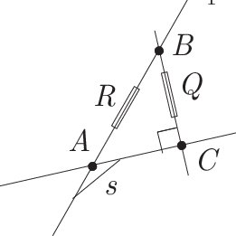

## Midian Larune

### Preamble
*Ive removed the soh-cah-toa method of trigonometry using Euclids rules for sides and angles. This is because it no longer makes sense now that we have introduced rational trigonometric ideas into our reasoning for things. It redefines those trig functions for angles, and in favor for something conceptually geometric—where in it does not have to rely on those sin,cos and tan relationships to specific side lengths... Instead it has a dynamic, more general approach where angles are defined by the context they are given in. More specifically, it uses ratios and quadrances in place of functions.*

### Synopsis
Begin looking through a quadratic extension into complex numbers, and describe quaternions in the context of rational trigonometry (quadrances and the relationships between the spreads and sides in isometric transformations such as dilation-rotation,etc). This requires identifying those concepts of "state" or potential state of operands, as well as the "instrinsic" value of operators and as they are contained within its group. In that way we will be prepared to go through the steps to reach rational trig & the fourth dimensional space of quaternion numbers.


**Introduction**

What we're getting at is the intrinsic value of functions and their operators. I think it would be premature to study those values and transformations all at once. Therefore we will begin by logically deducing a simpler connection, and see if we can formalize our understanding of those operational mechanisms; That is, we need to resolve or find new ways of looking at everything, creating a distinction between *vague definitions* of a given transformation for example, and a complete summary of its internal properties. They are all just random mathematical components until we can illustrate them, holistically speaking.

**Dimensionality**

In a similar vein, we should consider dimensionality and how each subsequent dimension encapsulates the characteristics of the dimensions preceding it. Its an averaging of each dimension that is creating the canonical value of those points inside. This'll be particularly relevant to our ideas. In the context of vectors, two vectors are <b>orthogonal</b> if their dot product is zero. Geometrically, this means they intersect to form a 90-degree angle. If we have two vectors `a=(a1,a2)` and `b=(b1,b2)` their dot product is defined as:

`a⋅b = (a)^2⋅(b)^2 − (a⋅b)^2`

When calculating rise/run, where in you need three parts, rise/run/hypotenuse... and the hypotenuse is stellated (cross-sectioned, or extending a polygons sides) with the adjacent side... therefore you're actually defining two, smaller rt triangles (i.e. a rectangle) that lives outside the ratio at the point where youd originally consider (0), where (0) is a defined region in this method of quadrance (the analogue of distance or length, defined as the square of the distance between two points)

**Functorials**

They refer to constructions related to functors. A functor is a mapping between two categories that preserves the structure of those categories. In simpler terms, it’s a way to take objects and morphisms (the arrow or structure-preserving mapping between objects) from one category and systematically transform them into objects and morphisms in another category, while respecting how they are composed and related.

The term functorial is an adjective used to describe something that behaves in a manner consistent with functors—meaning it respects certain structural rules or relations, especially when transforming or mapping between different mathematical structures.

Now, regarding their relationship to operators: both functorials (via functors) and operators deal with transformations, but in different contexts. Operators typically refer to functions or maps within a single space (e.g., linear operators in a vector space), whereas functors work across categories of spaces.

For example, in functional analysis, an operator might transform a vector in a vector space. A functor, by contrast, would map not only between different vector spaces but also map how operators act between those spaces.

So, the connection between functorials and operators lies in the idea of transformation, but functorials take this to a higher level of abstraction by mapping not just individual elements (like vectors) but entire structures (like spaces and the functions between them).

**Inter-related Example**

Consider the following example to illustrate these connections:

You have two sets  `A={1,2,3}` and `B={x,y}`. A function `f:A→B` might be defined as `f(1)=x`,`f(2)=y`,`f(3)=x`
Now, consider a vector space `V` with vectors represented as
```
( a
  b 
```
A linear operator `T:V→V` might be defined as:
```
T(( a ))      ( 2a
    b     =     3b
```
This operator doubles the first component and triples the second. If we take the category of vector spaces (Vect) and define a functor `F:Vect→Set`, it could map each vector space `V` to its underlying set of vectors, and each linear transformation `T` to a function `F(T)` that operates on these sets in a way that respects the linear structure.

In order to prepare us for these kinds of transformative relationships, we need to adopt the idea of states. Lets say we have two variables, `numerator/denominator` and it can be represented as:
`n = 1, d = 2`
`1/2 * 2/1 = 1*2 / 2*1`

`1*2 / 2*1 = 2/2` *(or out of the state)*

`2/2 = 1` or `1/1`, where `1/1` is some kind of transformation out of the state... Therefore you want to stay within `1/2 * 2/1 = 1*2 / 2*1` this box (you can construct a box where each ratio is equivalent - and this represents a group, or multiple states (potential states))

Or more simply
```
n/d * d/n = (n*d)/(d*n) = 1
```
Anything that can be called `1` or `2` can be called `1/2`, `2/1` and `1*2`

In that sense you might call it a "closed ratio system", which means this "box" or set is self-contained and it maintains equivalence only within the context its presented in. In order to relate things in a uniform way, it must include a third part (much like the rise/run/hypotenuse) such that it satisfies both this interdependence and potential state relationship. If `x` represents our ratio `n/d/h`, then it says something about its two variables (potential state operands), and particularity of multiple variables, `x > 1`
```
x  =  1  2   or   2  1
      2  1        1  2
      h  h        h  h
```
Algebraic reasoning might suggest...
```
x  = A/B  ⇒ B/C  ⇒ C/A
```
This is the principle that preceeds analysis and discerning any box that a select group of operands belong to. This might suggest that what we're achieving is the intrinsic value of operations and their subsequent relationship. We want to expose what happens to those ratios, therefore we need to subject it to some other operation. First we should ask a few general questions: "What is the common theme that arises?", or "What is the relationship between (e.g. divisor and adder), where a "divisor" is our base group, and "adder" is the new operation that we want to contain, thereby analyzing the common threads that stem from being operated against (by our base operator, divisor). After putting two operations into a contention of sorts, we have to establish what it means to compare them in such a way that it doesnt violate either group.

p.s. This may get into the relationship w/ other concepts in mathematics like **Order Theory**, which investigates the intuitive notion of order using binary relations, providing the frameworks for describing statements such as "this is less than that" or "this precedes that". We'll also be explaining boxed arithmetic at some point...

**Msets** (multiplicity sets)

They provide a way to represent mathematical objects like numbers, polynomials, etc.

- mset of zeros (`mset0`) is a collection of zeros, where each zero can have a multiplicity. This multiplicity indicates how many times that zero "appears" in the collection. For example, the mset {0, 0, 1, 2, 2, 2} represents a collection with two zeros, one one, and three twos.
- mset of naturals (`mset_nat`) is similar to an mset of zeros, but it contains positive integers (naturals) instead of zeros. For instance, the mset {1, 1, 2, 3, 3, 3} represents a collection with two ones, one two, and three threes.
- mset of polynomials (`mset_polynom`) is a collection of polynomials, where each polynomial can have a multiplicity.
- etc. (`mset_monomial`, `mset_binomial`, `mset_trinomial`, `mset_multinom`)

Monomials as we said, they are a single term like X, 5, -3, or what-have-you... And they are relevant in this context when we are talking about sets or msets and need to explain/build upon situations where its a non-monomial, or simply need to describe a set.

Each element in an mset has a multiplicity, which is a non-negative integer. The order of elements in an mset is not significant, and, in terms of equality, two msets are considered equal if they have the same elements w/ the same multiplicities. For example:

Consider the polynomial `p(x) = (x-1)^2(x+2)^3` (that is a power of a power, sometimes called nested powers, which follows the power to the power rule). This polynomial can be represented by the mset of its roots: {1, 1, -2, -2, -2}. Here, the root 1 has a multiplicity of 2, and the root -2 has a multiplicity of 3. On the other hand, a **list** and a **set** are different than msets in that they prescribe an actual value to each unique element, where the *order* of it is only important in a **list**.


Spreads or ratios can be thought of like protractors that have the same range on both sides, adjoining at the top... This implies two non-parallel lines, and the length (or simply "angle") in between those sides. Another way to say it is that the ratio of a spread is the vertical spread divided by the horizontal spread. When we calculate the dot product of two vectors in rational trigonometry, we are essentially comparing the product of their spreads. *note: if you follow through `R` passed B, that point off screen is D*

In simple terms, we dont treat any points as (0) (the spread of two *parallel* lines can still be called zero) therefore points are always in the context of an identifiable region of integers, and the spread can be considered a normal ratio (e.g. `1/2`) ... At most `1/1` is one whole turn, or by the least a spread will describe lines that are parallel, i.e. (`0`)

Points are colinear if they lie on the same line

`Spread (A, B, C) = Spread (A, B, D) + Spread (A, C, D)`

`Spread (A, B) + Spread (A, C) = Spread (A, D)`

Quadrance is a measure of distance (or relative separation) between two points. In the context of the spread `ABCD`, and if the coordinates of `A` are `x1,y1` and the coordinates of `B` are `x2,y2`, then the quadrance `Q` between `A` and `B` can be calculated using the distance formula:

`Q=(x2−x1)^2 + (y2−y1)^2`


*To be continued...*


**Complex Numbers**

You can draw the y-axis, labeling it "imaginary" and similarly an x-axis as "real" and this would be your complex plane. Plotting a number in between those would be a complex number.


**Quaternions** *(to be continued...)*

Within complex numbers, imaginary unit `i` (OR any variable which itself is considered complex when subjected to this situation) satisfies `i^2 = -1` as well as `-1^(1/2)` or `sqrt{-1}`... And so therefore `i` itself is not special, and is rather a conventional term to signify a variable. While they might seem abstract, imaginary numbers are just as real as any other numbers. They provide a way to represent points on the complex plane, which incorporates both real and imaginary components. Imaginary units, `i`, `j` and `k` satisfy `i^2 = j^2 = k^2 = -1`... they are also non-commutative in that `j, k, i` or `(-1)`, is not the same as `i, j, k` or `(1)`.. when presented as those forms of arithmetic.

`q = a + bi + cj + dk` is a quaternion.
we can represent a quaternion as `q = s + v`, where: `s = a` is the scalar part (one dimension) and `v = bi + cj + dk` is a vector part...

Quaternions are non-commutative and non-associative when under specific multiplication (or just specific "states")

SU(2) and quaternions share a connection because of the group of unit quaternions (denoted as `S^3`) which is isomorphic to SU(2). Or any matrix `A` for SU(2), has the determinant  `det(A)=1`. This means that mathematically, the structures of `S^3` and SU(2) are essentially the same, even though they arise from different contexts.

`S^3` is the set of points in `R^4` that satisfy the equation:

`x_1^2 + x_2^2 + x_3^2 + x_4^2 = 1`, or the coordinates in 4 dimensional space

If there is a "bijective mapping" between two groups that preserves the group operation, then those groups are isomorphic. Something is isomorphic if its both injective and surjective. A function `f:A→B`  is injective if each element in set `A` maps to a unique element in set `B`, (or in other words, no two distinct elements in set `A` map to the same element in set `B`) Similarly, a function `f:A→B` is surjective if the function covers the entire range of set `B`. Mathematically, for every element `b` in `B`, there exists at least one element `a` in `A` such that `f(a)=b`.

I want to work backwards and go over some of the interesting ideas found in boxed arithmetic in relation to msets. We also want to work out how the observations made in the properties of operations applies to transpositions, such that we can differentiate those situations where we want a *vague definition* for a given tranformation, versus outputting a complete summary of the linear map. Bare with me until i get around to filling in all the missing pieces, and in a way that is more coherent.
